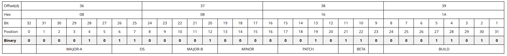

# aftereffects-version-check

A Python script to determine the After Effects Version used to save the project.

This script is rewritten and now actually calculates the project version instead of just comparing a HEX string in a data table.

After some more data analysis I finally understood how the project version is encoded in the project file. See the analysis below.

I have kept the JSON data for further analysis and to look up the year the software version was released.

## How to run

`py afx-version-check.py PROJECTFILE.aep`

## Examples

Under the folder **aftereffects_projects** there are some project files to test the script
For example: `py afx-version-check.py aftereffects_projects/2023_23-3-0_build53.aep`

## Analysis

Example: **17.0.2 (Win) (Build 26)** (Structure is Major.Minor.Patch (OS) (Build) BETA )

At offset 36 in the project file we get a HEX string of **0B 08 16 1A**

| Bits              | Purpose                                                           |
|-------------------|-------------------------------------------------------------------|
| Bit 1-8           | Build                                                             |
| Bit 10            | If 0 then BETA                                                    |
| Bit 12-15         | Patch- or Bugfix-Version                                                     |
| Bit 16-19         | Minor-Version                                                     |
| Bit 27-31 & 20-22 | Major-Version is split up. MAJOR-A and MAJOR-B have to be merged. |
| Bit 23-26         | Operation System (Win = 1100, Mac = 1101, Mac Arm 64 = 1110 )     |
